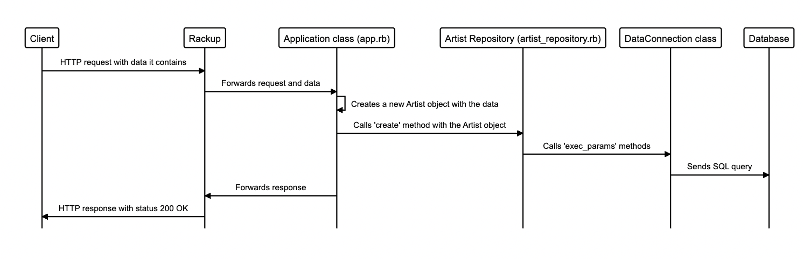
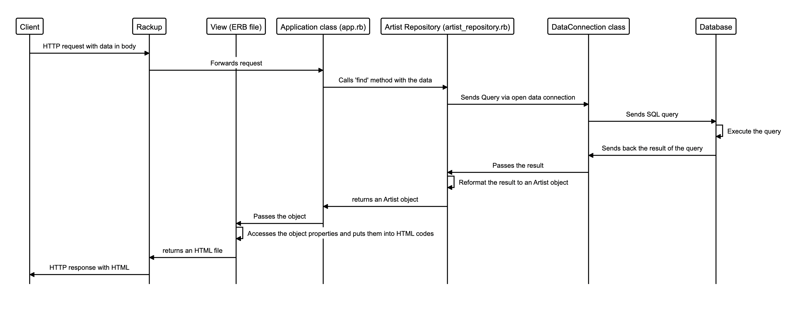

# Test-driving Music Library Routes

This challenge asks me to create CRUD routes with TDD.

- [Test-driving Music Library Routes](#test-driving-music-library-routes)
  - [Route Signature](#route-signature)
  - [Examples](#examples)
    - [GET `/albums`](#get-albums)
    - [GET `/artists`](#get-artists)
    - [POST `/albums`](#post-albums)
    - [POST `/artists`](#post-artists)
  - [Diagrams](#diagrams)
    - [POST `/artists`](#post-artists-1)
    - [GET `/artists/:id`](#get-artistsid)

## Route Signature

| Method | Path         | Query | Body                           | Response        |
| ------ | ------------ | ----- | ------------------------------ | --------------- |
| GET    | /albums      | -     | -                              | albums_all.erb  |
| GET    | /artists     | -     | -                              | artists_all.erb |
| GET    | /albums/:id  | -     | -                              | albums_one.erb  |
| GET    | /artists/:id | -     | -                              | artists_one.erb |
| POST   | /albums      | -     | title, release_year, artist_id | -               |
| POST   | /artists     | -     | name, genre                    | -               |

## Examples

### GET `/albums`

```
# Request:

Method: GET /albums

# Expected response:

Body: "Doolittle, Surfer Rosa, ...Ring Ring"
Status: Response for 200 OK

```

### GET `/artists`

```
# Request:
GET /artists

# Expected response
Body: Pixies, ABBA, Taylor Swift, Nina Simone
Status: Response for 200 OK
```

### POST `/albums`

```
# Request:

Method: POST /albums
Body: { title: "Voyage", release_year: 2022, artist_id: 2 }

# Expected response:

Status: Response for 200 OK
```

### POST `/artists`

```
# Request:
POST /artists

# With body parameters:
name=Wild nothing
genre=Indie

# Expected response (200 OK)
(No content)

# Then subsequent request:
GET /artists

# Expected response (200 OK)
Pixies, ABBA, Taylor Swift, Nina Simone, Wild nothing
```

## Diagrams

### POST `/artists`



### GET `/artists/:id`


